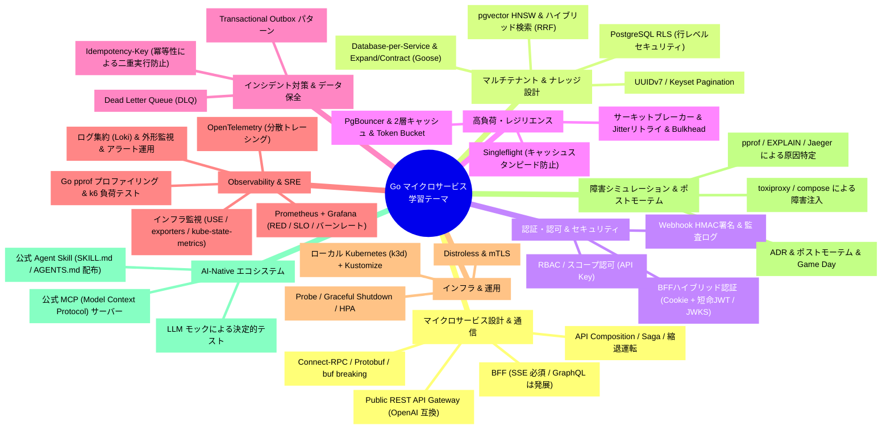

# golang-microservice-sample

Go言語を用いた**マイクロサービスアーキテクチャの実践的な設計・実装・運用技術**を体系的に学ぶための学習用リポジトリです。

架空のエンタープライズ向けAIエージェント基盤「**AgentForge Enterprise**」の開発を題材とし、単なるCRUD開発にとどまらず、**Connect-RPC、BFF (SSE / GraphQL)、マルチテナントRLS、pgvector (RAG)、MCP (Model Context Protocol)、認証認可 (Session Cookie + 短命JWT)、高負荷対策、インシデント防止、ローカルKubernetes、障害シミュレーション（Game Day）** に至るまで、シニアバックエンドエンジニアに求められる実践的なテーマを検証・学習します。

---

## 🎓 本リポジトリの学習原則（Mentoring First）

本リポジトリは**「開発者自身が手を動かしてGo言語によるマイクロサービス・分散システムの実装力を血肉にすること」**を最重要目的としています。

そのため、AIアシスタントとのペアプログラミングにおいて以下の原則を定めています（詳細は [AGENTS.md](AGENTS.md) を参照）：

1. **コード作成・各種コマンドの実行は手動で行う**:
   - AIが自動でソースコードを一括生成したり、シェルコマンドを裏で勝手に実行することはしません。
2. **AIは「メンター・ナビゲーター」に徹する**:
   - AIは「コードの書き方の指示」「設計思想やトレードオフの解説」「実行すべきコマンドと期待される出力」の提示にとどめます。
3. **段階的に理解を深めながら進める**:
   - 1ファイル・1ステップずつ、手元で動く手応え（成功体験）を確認しながら着実に実装を進めます。
4. **壊してから直す（詰まり体験を設計に組み込む）**:
   - すべてのStepに「防御なしの状態で事故を再現し、自力で原因を特定してから対策を入れる」障害シミュレーションを組み込みます。AIは再現手順だけを示し、**対策を先に教えません**。
5. **判断と失敗を言語化する**:
   - Stepごとに ADR（設計判断の記録）とポストモーテム（障害の振り返り）を書き、「なぜそうしたか」を説明できる力を鍛えます。

---

## 🎯 本リポジトリで学びたいこと（学習テーマ）

本リポジトリでは、以下の9つの主要テーマを実際に手を動かしながら段階的に学習します。



---

## 🛠 技術スタック

| レイヤー | 技術 / ツール | 学習目的 |
| :--- | :--- | :--- |
| **言語** | Go 1.27+ | 高並行・型安全なマイクロサービス & Gateway実装 |
| **BFF** | Go (HTTP/2 SSE ストリーミング) / GraphQL (gqlgen, 発展課題) | **Vercel AI SDK (`useChat`) と直結可能**なリアルタイム思考ストリーミング、DataLoader による N+1 解消 |
| **外部連携 API** | REST / OpenAI互換 | **OpenAI互換 (`/v1/chat/completions`)** ＆ 管理REST (Cursor/Python直結) |
| **内部通信** | [Connect-RPC](https://connectrpc.com/) / Protobuf ([Buf](https://buf.build/)) | HTTP/2・型安全なサービス間通信 & Server Streaming、`buf breaking` による後方互換性ゲート |
| **データベース** | PostgreSQL (RLS + pgvector) + PgBouncer | マルチテナント分離・ベクトル検索（RAG）・接続プーリングの落とし穴 |
| **DBアクセス & マイグレーション** | [sqlc](https://sqlc.dev/) + [Goose](https://github.com/pressly/goose)（発展: [Atlas](https://atlasgo.io/) `migrate lint`） | 型安全SQL生成 & Expand/Contract による無停止マイグレーション（[ADR-0003](docs/adr/0003-use-goose-for-migrations.md)） |
| **キャッシュ & イベント** | Valkey / Redis, NATS JetStream | 分散キャッシュ、レートリミッター、Transactional Outbox、DLQ |
| **監視・計測（アプリ）** | OpenTelemetry, Jaeger, Prometheus, Grafana, Alertmanager | 分散トレーシング、REDメトリクス、SLO とバーンレートアラート |
| **監視・計測（インフラ）** | node_exporter, cAdvisor, kube-state-metrics, postgres_exporter, Loki, blackbox_exporter | USE メトリクス、ログ集約、外形監視、予測アラート、アラート抑制（Datadog 型の監視を OSS で再現） |
| **負荷試験 & プロファイリング** | [k6](https://k6.io/), `net/http/pprof` | ボトルネック計測・限界性能テスト |
| **障害注入** | [toxiproxy](https://github.com/Shopify/toxiproxy), `docker compose pause/stop`, `psql` ロック | 遅延・切断・停止・ロック待ちを意図的に再現する詰まり体験 |
| **テスト** | Func Mock, `go-cmp`, [testcontainers-go](https://golang.testcontainers.org/) | 並行単体テストと、実 DB を使った RLS 越境の統合テスト |
| **LLM / MCP モック** | `tools/llm-mock`, `tools/mcp-mock`, `tools/webhook-receiver` | 外部 API に依存しない決定的テスト、ハング・429・巨大出力の再現 |
| **ローカル Kubernetes** | [k3d](https://k3d.io/) (軽量k8s) + [Kustomize](https://kustomize.io/) | ローカル完結でのコンテナオーケストレーション、Probe / Graceful Shutdown / HPA |
| **AI エコシステム** | [Model Context Protocol (MCP)](https://modelcontextprotocol.io/) | AIエージェント連携用公式ツールサーバー |

Turso / TiDB / Terraform は検討の上、学習の深さを優先してスコープ外としました（[ADR-0002](docs/adr/0002-scope-out-turso-tidb-terraform.md)）。

---

## 📁 ディレクトリ構成

```text
.
├── apps/                        # 各マイクロサービス & Gateway（各サービスに Dockerfile を持つ）
│   ├── bff-gateway/             # チャットUI専用 BFF (SSEストリーミング / Vercel AI SDK直結 / 発展: GraphQL)
│   ├── public-api/              # 外部連携 Gateway (OpenAI互換 /v1/chat/completions & 管理REST / RBAC / レートリミット / 監査ログ)
│   ├── agentforge-mcp/          # 【AI連携】公式 MCP (Model Context Protocol) サーバー
│   ├── auth-service/            # 認証・IAM・API Key管理・内部JWT発行 (JWKS)・クォータ
│   ├── agent-service/           # エージェント自律思考ループ・セッション管理・Saga・MCPクライアント
│   ├── context-service/         # 階層型コンテキスト統合 (Context Engine) & ナレッジ (RAG/pgvector)・Skills管理 (RLS)
│   └── notification-service/    # イベント・Webhook配信サービス (Outbox / HMAC署名 / DLQ)
│
├── tools/                       # 学習・テスト用の偽サーバー（外部依存を排除し、障害を再現する）
│   ├── llm-mock/                # OpenAI 互換の偽 LLM (stream / 429 / hang / loop などのシナリオ切替)
│   ├── mcp-mock/                # ハング・巨大出力・エラーを返す偽 MCP サーバー
│   └── webhook-receiver/        # HMAC 署名検証とリプレイ防止を実装した受信側サンプル
│
├── proto/                       # Connect-RPC / Protobuf 定義 (Buf)
│
├── pkg/                         # サービス横断の共通Goパッケージ
│   ├── connectutil/             # RPC インターセプター (ログ/リカバリ/デッドライン/認可伝播)
│   ├── telemetry/               # OpenTelemetry (trace 伝播 / メトリクス / slog 相関)
│   ├── idempotency/             # 冪等性キーハンドラー
│   ├── ratelimit/               # Redis Token Bucket レートリミッター
│   ├── resilience/              # Singleflight / サーキットブレーカー / Jitterリトライ / Bulkhead
│   ├── authn/                   # Session Cookie & 短命JWT (JWKS 検証) & API Key 検証
│   ├── authz/                   # RBAC / スコープ認可
│   ├── logging/                 # 機密情報マスキング・構造化ロガー
│   ├── database/                # RLS (WithTenant) / pgvector / トランザクション / Outbox ヘルパー
│   └── testutil/                # testcontainers による統合テスト用ヘルパー
│
├── docs/                        # 仕様書・設計書・意思決定記録
│   ├── roadmap.md               # 段階的学習ロードマップ（詳細版: 完了条件 / 障害シミュレーション / 深掘りの問い）
│   ├── service-spec.md          # 想定サービス「AgentForge Enterprise」のドメイン・業務要件
│   ├── architecture.md          # なぜマイクロサービスにするか・アーキテクチャ詳細
│   ├── tech-selection.md        # 技術選定の調査・比較検討・トレードオフ記録
│   ├── adr/                     # 個別アーキテクチャ決定記録 (ADR)
│   ├── postmortems/             # 障害シミュレーションのポストモーテム
│   └── principles.md            # Step 16 で全ポストモーテムから抽出する設計原則
│
├── ecosystem/                   # 外部開発者 & 自社フロント & AI向け配布物
│   ├── mcp/                     # MCP Server 設定 & クライアント設定例
│   ├── skills/                  # 公式 Agent Skill (SKILL.md / AIコーディング指示書)
│   └── openapi/                 # OpenAPI 定義 & クライアントSDK
│
├── iac/                         # Infrastructure as Code
│   ├── docker/                  # Docker Compose (PostgreSQL+pgvector, Redis, NATS, Jaeger, toxiproxy, PgBouncer, 各サービス)
│   ├── k8s/                     # ローカル Kubernetes 定義 (k3d / Kustomize)
│   └── monitoring/              # Prometheus / Alertmanager / Loki / Grafana ダッシュボード / exporter の定義
│
├── loadtests/                   # k6 による負荷テストシナリオと Before/After レポート
│   ├── scenarios/
│   └── reports/
│
├── Taskfile.yaml                # ワンコマンド実行タスク (compose 起動, proto生成, 統合テスト, 負荷テスト等)
└── README.md
```

---

## 🔥 障害シミュレーション（詰まり体験）の進め方

実務でシニアが信頼される理由は「事故を見たことがある」からです。本リポジトリでは、それを安全なローカル環境で意図的に再現します。

1. **AI が台本を出す**: 障害シナリオと再現手順のみを提示します。対策は提示しません。
2. **自分で壊す**: 手順どおりに再現し、症状を観察します（ログ、`pprof`、`EXPLAIN ANALYZE`、Jaeger、`pg_stat_activity`）。
3. **仮説を立てる**: 「何が起きているか」「なぜか」を自分の言葉で説明します。AI は段階的にヒントを出します。
4. **直して再実行**: 対策を実装し、同じ手順で再現しないことを確認します。
5. **ポストモーテムを書く**: [docs/postmortems/TEMPLATE.md](docs/postmortems/TEMPLATE.md) に沿って記録します。

ツールボックス、インシデント種別と Step の対応表は [docs/roadmap.md](docs/roadmap.md#🔥-障害シミュレーション詰まり体験の進め方) を参照してください。

---

## 🗺 段階的学習ロードマップ

小さく動くものを作りながら、確実にステップアップしていく実践型ロードマップです。
ジュニアとシニアを分ける**「実務で直面する非機能要件（セキュリティ・耐障害性・可観測性・ゼロダウンタイム運用）」**を全編に組み込み、各 Step を **必須 / 発展** に分けて深さを優先しています。

各 Step は「🎯 完了条件 / ✅ 必須 / ⭐ 発展 / 💥 障害シミュレーション / 🔍 深掘りの問い / 📝 記録（ADR・ポストモーテム）/ 📚 一次情報」で構成されています。**詳細は [docs/roadmap.md](docs/roadmap.md) を参照してください。**

- [x] **[Step 0: 開発環境の土台作り](docs/roadmap.md#step-0-開発環境の土台作り)**: `go.work`、Buf、Docker Compose（PostgreSQL + pgvector、Redis）
- [x] **[Step 1: プロトコル定義](docs/roadmap.md#step-1-プロトコル定義)**: 認証サービスの Protobuf 定義と `buf generate`
- [x] **[Step 2: 認証とテナント管理](docs/roadmap.md#step-2-認証とテナント管理)**: `auth-service`（API Key ハッシュ照合、sqlc、Func Mock テスト、ログマスキング）。復習用の 💥 あり
- [ ] **[Step 3: 運用の土台](docs/roadmap.md#step-3-運用の土台)**: Dockerfile と compose 統合、最小 OpenTelemetry（Jaeger）、`buf breaking` と `govulncheck`、testcontainers による統合テスト基盤
- [ ] **[Step 4: データ基盤と RLS](docs/roadmap.md#step-4-データ基盤と-rls)**: `context-service` のスキーマ、Goose マイグレーション、Row Level Security、RLS 越境テスト、Expand / Contract
- [ ] **[Step 5: ナレッジ検索とコンテキスト合成](docs/roadmap.md#step-5-ナレッジ検索とコンテキスト合成)**: pgvector HNSW、UUIDv7、ハイブリッド検索（RRF）、階層型コンテキスト合成エンジン
- [ ] **[Step 6: 思考ループとストリーミング](docs/roadmap.md#step-6-思考ループとストリーミング)**: `agent-service` の ReAct 状態マシン、LLM モック、Server Streaming、Cascading Deadline、Keyset Pagination
- [ ] **[Step 7: 分散制御](docs/roadmap.md#step-7-分散制御)**: Saga と補償トランザクション、MCP クライアントによるツール実行
- [ ] **[Step 8: BFF ゲートウェイ](docs/roadmap.md#step-8-bff-ゲートウェイ)**: SSE、API Composition、縮退運転と Bulkhead、ハイブリッド認証（auth-service が JWT を発行、BFF は鍵を持たない）、Idempotency-Key。発展: GraphQL + DataLoader。**ブラウザから対話できる感動を体験！** 🎉
- [ ] **[Step 9: 外部公開ゲートウェイ](docs/roadmap.md#step-9-外部公開ゲートウェイ)**: `public-api` の OpenAI 互換 API、透過的コンテキスト注入、RBAC / スコープ認可、レートリミット、監査ログ。**Cursor や `openai` SDK から直結する感動を体験！** 🚀
- [ ] **[Step 10: 可観測性の深掘り](docs/roadmap.md#step-10-可観測性の深掘り)**: Prometheus（RED）、Grafana、SLO とバーンレートアラート、pprof、Exemplar
- [ ] **[Step 11: イベント駆動と Webhook](docs/roadmap.md#step-11-イベント駆動と-webhook)**: `notification-service` の Transactional Outbox、NATS JetStream、HMAC 署名 Webhook、DLQ、サーキットブレーカー
- [ ] **[Step 12: 高負荷と耐障害性](docs/roadmap.md#step-12-高負荷と耐障害性)**: Singleflight、2 層キャッシュ、PgBouncer、k6 限界テストとチューニング
- [ ] **[Step 13: Kubernetes 運用](docs/roadmap.md#step-13-kubernetes-運用)**: k3d + Kustomize、Probe と Graceful Shutdown、HPA、mTLS、Distroless
- [ ] **[Step 14: インフラの状態監視](docs/roadmap.md#step-14-インフラの状態監視)**: USE メトリクス（node_exporter / cAdvisor / kube-state-metrics）、DB 監視（`pg_stat_statements`）、ログ集約（Loki）、外形監視、予測アラート、Alertmanager の抑制と Runbook。Datadog 型の監視を OSS で再現
- [ ] **[Step 15: MCP サーバーと Skills 配布](docs/roadmap.md#step-15-mcp-サーバーと-skills-配布)**: `agentforge-mcp` と `ecosystem/skills/SKILL.md`
- [ ] **[Step 16: Game Day](docs/roadmap.md#step-16-game-day)**: 総合障害訓練。複合障害の検知 → 切り分け → 復旧 → ポストモーテム。全 Step の学びを `docs/principles.md` に集約
