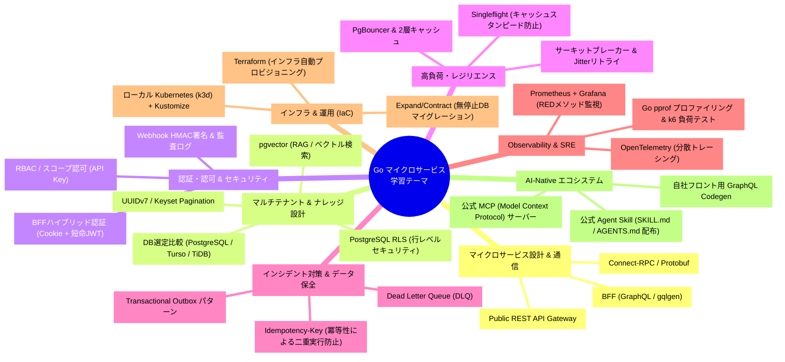

# golang-microservice-sample

Go言語を用いた**マイクロサービスアーキテクチャの実践的な設計・実装・運用技術**を体系的に学ぶための学習用リポジトリです。

架空のエンタープライズ向けAIエージェント基盤「**AgentForge Enterprise**」の開発を題材とし、単なるCRUD開発にとどまらず、**Connect-RPC、BFF (GraphQL)、マルチテナントRLS、pgvector (RAG)、MCP (Model Context Protocol)、認証認可 (Session Cookie + 短命JWT)、高負荷対策、インシデント防止、ローカルKubernetes/IaC** に至るまで、シニアバックエンドエンジニアに求められる実践的なテーマを幅広く検証・学習します。

---

## 🎓 本リポジトリの学習原則（Mentoring First）

本リポジトリは**「開発者自身が手を動かしてGo言語によるマイクロサービス・分散システムの実装力を血肉にすること」**を最重要目的としています。

そのため、AIアシスタントとのペアプログラミングにおいて以下の原則を定めています（詳細は [AGENTS.md](AGENTS.md) を参照）：

1. **コード作成・各種コマンドの実行は手動で行う**:
   - AIが自動でソースコードを一括生成したり、シェルコマンドを裏で勝手に実行することはしません。
2. **AIは「メンター・ナビゲーター」に徹する**:
   - AIは「コードの書き方の指示」「設計思想やトレードオフの解説」「実行すべきコマンドと期待される出力」の提示にとどめます。
3. **段階的に理解を深めながら進める**:
   - 1ファイル・1ステップずつ、手元で動く手応え（成功体験）を確認しながら着実に実装を進めます。

---

## 🎯 本リポジトリで学びたいこと（学習テーマ）

本リポジトリでは、以下の8つの主要テーマを実際に手を動かしながら段階的に学習します。



---

## 🛠 技術スタック

| レイヤー | 技術 / ツール | 学習目的 |
| :--- | :--- | :--- |
| **言語** | Go (1.24+) | 高並行・型安全なマイクロサービス & Gateway実装 |
| **BFF** | Go (HTTP/2 SSE ストリーミング) / GraphQL | **Vercel AI SDK (`useChat`) と直結可能**なリアルタイム思考ストリーミング |
| **外部連携 API** | REST / OpenAI互換 (Echo or Chi) | **OpenAI互換 (`/v1/chat/completions`)** ＆ 管理REST (Cursor/Python直結) |
| **内部通信** | [Connect-RPC](https://connectrpc.com/) / Protobuf ([Buf](https://buf.build/)) | HTTP/2・型安全なサービス間通信 & Server Streaming |
| **データベース** | PostgreSQL (RLS + pgvector), Turso, TiDB | マルチテナント分離・ベクトル検索（RAG）・DR検証 |
| **DBアクセス & マイグレーション** | [sqlc](https://sqlc.dev/) + [Atlas](https://atlasgo.io/) / [Goose](https://github.com/pressly/goose) | 型安全SQL生成 & ゼロダウンタイムマイグレーション |
| **キャッシュ & イベント** | Valkey / Redis, NATS JetStream | 分散キャッシュ、レートリミッター、Transactional Outbox |
| **監視・計測** | OpenTelemetry, Jaeger, Prometheus, Grafana | 分散トレーシング、REDメトリクス可視化 |
| **負荷試験 & プロファイリング** | [k6](https://k6.io/), `net/http/pprof` | ボトルネック計測・限界性能テスト |
| **ローカル Kubernetes** | [k3d](https://k3d.io/) (軽量k8s) + [Kustomize](https://kustomize.io/) | ローカル完結でのコンテナオーケストレーション |
| **IaC** | **Terraform** / OpenTofu | クラウド無料枠・外部インフラのコード化 |
| **AI エコシステム** | [Model Context Protocol (MCP)](https://modelcontextprotocol.io/) | AIエージェント連携用公式ツールサーバー |

---

## 📁 ディレクトリ構成

```text
.
├── apps/                        # 各マイクロサービス & Gateway
│   ├── bff-gateway/             # チャットUI専用 BFF (SSEストリーミング / Vercel AI SDK直結)
│   ├── public-api/              # 外部連携 Gateway (OpenAI互換 /v1/chat/completions & 管理REST)
│   ├── agentforge-mcp/          # 【AI連携】公式 MCP (Model Context Protocol) サーバー
│   ├── auth-service/            # 認証・IAM・API Key管理サービス
│   ├── agent-service/           # エージェント自律思考ループ・セッション管理サービス
│   ├── context-service/         # 階層型コンテキスト統合 (Context Engine) & ナレッジ (RAG/pgvector)・Skills管理 (RLS)
│   └── notification-service/    # イベント・Webhook配信サービス (HMAC署名 / DLQ)
│
├── proto/                       # Connect-RPC / Protobuf 定義 (Buf)
│   ├── buf.gen.yaml
│   ├── buf.yaml
│   └── sync/
│
├── pkg/                         # サービス横断の共通Goパッケージ
│   ├── connectutil/             # RPC インターセプター (ログ/リカバリ/Trace/デッドライン)
│   ├── idempotency/             # 冪等性キーハンドラー
│   ├── ratelimit/               # Redis Token Bucket レートリミッター
│   ├── resilience/              # Singleflight / サーキットブレーカー / Jitterリトライ
│   ├── authn/                   # Session Cookie & 短命JWT & API Key 検証
│   ├── authz/                   # RBAC / スコープ認可
│   ├── logging/                 # 機密情報マスキング・構造化ロガー
│   └── database/                # RLS / pgvector / トランザクション / Outbox ヘルパー
│
├── docs/                        # 仕様書・設計書・意思決定記録
│   ├── service-spec.md          # 想定サービス「AgentForge Enterprise」のドメイン・業務要件
│   ├── architecture.md          # なぜマイクロサービスにするか・アーキテクチャ詳細
│   ├── tech-selection.md        # 技術選定の調査・比較検討・トレードオフ記録
│   └── adr/                     # 個別アーキテクチャ決定記録 (ADR)
│
├── ecosystem/                   # 外部開発者 & 自社フロント & AI向け配布物
│   ├── mcp/                     # MCP Server 設定 & クライアント設定例
│   ├── skills/                  # 公式 Agent Skill (SKILL.md / AIコーディング指示書)
│   └── openapi/                 # OpenAPI 定義 & クライアントSDK
│
├── iac/                         # Infrastructure as Code
│   ├── docker/                  # 初期開発用 Docker Compose (PostgreSQL+pgvector, Redis)
│   ├── k8s/                     # ローカル Kubernetes 定義 (k3d / Kustomize)
│   └── terraform/               # クラウド無料枠・外部プロビジョニング定義
│
├── loadtests/                   # k6 による負荷テストシナリオ
│   └── scenarios/
│
├── Taskfile.yaml                # ワンコマンド実行タスク (k3d構築, proto生成, 負荷テスト等)
└── README.md
```

---

## 🗺 挫折しない！段階的学習ロードマップ

小さく動くものを作りながら、確実にステップアップしていく実践型ロードマップです。

- [ ] **Step 0: 開発環境の土台作り（Monorepo & 最小インフラ）**
  - Go 1.24+ ワークスペース（`go.work`）と `pkg/` 共通パッケージのスケルトン作成
  - Buf (`buf.yaml`, `buf.gen.yaml`) によるProtobufコード生成環境の整備
  - Docker Compose による開発用DB（PostgreSQL + `pgvector`）の起動
- [ ] **Step 1: プロトコル定義 (Schema-First & Connect-RPC)**
  - `proto/` に認証・コンテキスト・エージェントのProtobufスキーマを定義
  - `buf generate` による型安全なGoインターフェース自動生成を体験
- [ ] **Step 2: 認証 & テナント管理 (Auth & IAM Service)**
  - `auth-service` 実装: BFFハイブリッド認証（Session Cookie + 短命JWT）、API Keyハッシュ管理
  - テナント分離のコンテキスト伝播の基礎実装 & 単体テスト・疎通確認
- [ ] **Step 3: 階層コンテキスト & ナレッジ基盤 (Context & Knowledge Service)**
  - `context-service` 実装: PostgreSQL RLS（行レベルセキュリティ）による他テナント完全遮断
  - `pgvector` によるマルチテナントRAG検索（UUIDv7採用、ハイブリッド検索）
- [ ] **Step 4: エージェント自律思考ループ (Agent Runtime Service)**
  - `agent-service` 実装: 自前ReAct思考ループ基盤
  - Connect-RPC Server Streaming による思考ログ・トークン逐次配信
- [ ] **Step 5: BFFゲートウェイ開通 & リアルタイムストリーミング**
  - `bff-gateway` 実装: Go HTTP / SSE によるストリーミングエンドポイント
  - **Vercel AI SDK (`useChat`) やブラウザから接続し、リアルタイムに対話できる感動を体験！** 🎉
- [ ] **Step 6: 高負荷・耐障害性 & 非同期Webhook (Resilience & SRE)**
  - `notification-service` 実装: Transactional Outbox + NATS による非同期イベント通知 & HMAC署名Webhook
  - Singleflight（キャッシュスタンピード防止）、サーキットブレーカー、Redisレートリミット
  - `k6` による負荷試験 ➔ Jaeger/Prometheusでのボトルネック可視化・改善
- [ ] **Step 7: 本番IaC & Kubernetes運用 (k3d + Kustomize)**
  - Docker Compose から `k3d`（軽量k8s）への移行
  - Kustomizeマニフェスト管理（Service, Ingress, ConfigMap, Secret）による完全無料のk8sクラスタ運用
- [ ] **Step 8: 【AI-Native 発展】MCP Server & 公式Skills配布**
  - `agentforge-mcp`: Goによる公式MCPサーバー実装（Claude/Cursorから直接操作）
  - `ecosystem/skills/SKILL.md`: 外部開発者および自社フロント向けのAI指示書作成

