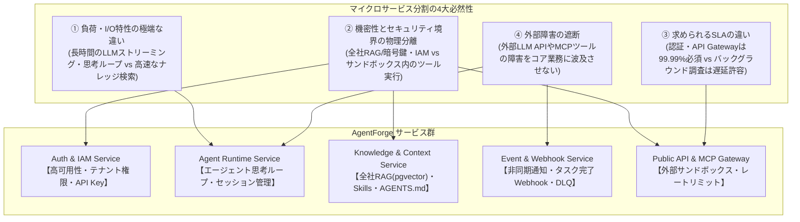
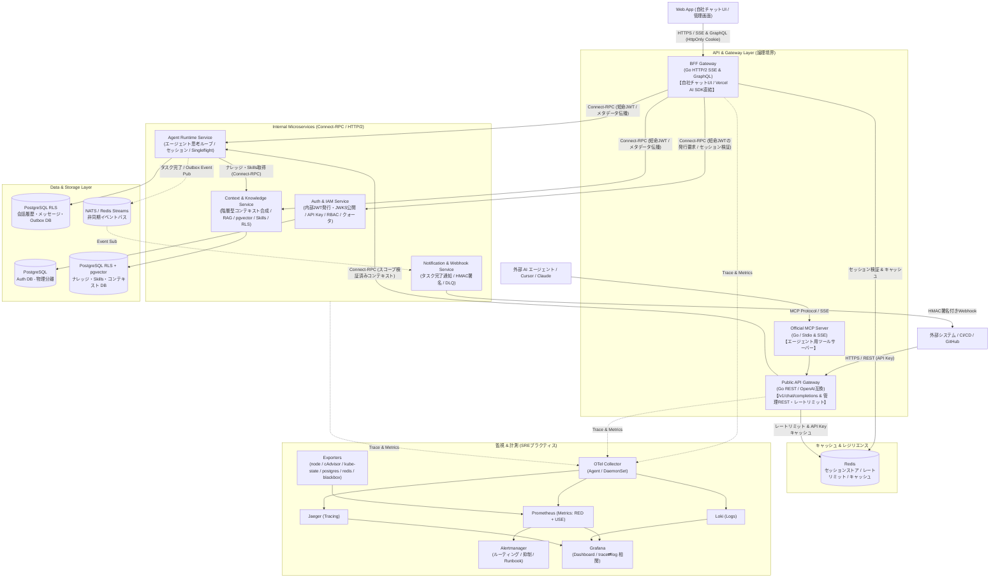
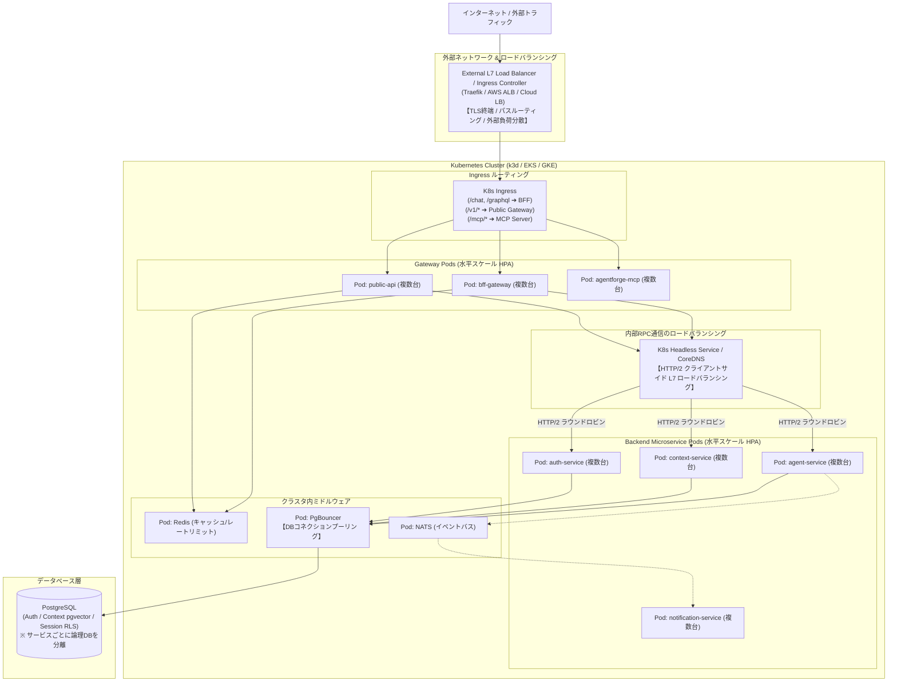

# AgentForge Enterprise システム & インフラ アーキテクチャ設計書

本ドキュメントでは、エンタープライズAIエージェント基盤「**AgentForge Enterprise**」における**「① アプリケーション論理アーキテクチャ（ソフトウェア境界・通信）」** と **「② インフラ・ネットワーク構成（Kubernetes・ロードバランサー・配置）」** を明確に切り分けて解説します。

---

## 🎯 1. なぜマイクロサービスにするのか？（分割の必然性）

AIエージェントプラットフォームでは、コンポーネントごとに**負荷特性・稼働要件・セキュリティ境界が極端に異なる**ため、マイクロサービス化の必然性が極めて高くなります。

---

## 🧩 2. アプリケーション論理アーキテクチャ（ソフトウェア設計）

各サービス間の責務、APIの境界、データフローを定義した論理構成です。

---

## 🏗 3. インフラストラクチャ & ネットワーク構成（Kubernetes 物理配置）

---

## 🚨 重大インシデント防止設計

| インシデント種別 | 想定リスク | 実装する防御パターン |
| :--- | :--- | :--- |
| **連鎖倒れ (Cascading Failure)** | 外部LLMやMCPツールの障害・遅延から全サービスが共倒れ | **Exponential Backoff + Jitter**（指数リトライ制御） **サーキットブレーカー**（障害外部APIの即時遮断） **デッドライン伝播**（タイムアウトの全伝播） |
| **データ不整合・二重実行** | ネットワーク切断による再試行でエージェントタスクが二重起動 | **Idempotency-Key（冪等性キー）** による重複実行ガード **Transactional Outbox** によるセッション/イベントのアトミック更新 |
| **ポイズンメッセージ** | 不正なプロンプト/データでWorkerが無限クラッシュループ | **Dead Letter Queue (DLQ)** による異常メッセージの隔離 |
| **機密ナレッジ漏洩 (Cross-Tenant)** | クエリのWHERE句忘れによる他テナントの機密RAGデータ漏洩 | **PostgreSQL RLS (Row Level Security)** でDB層から完全遮断 Go型システムによる `TenantContext` 必須化 |
| **情報漏洩・監査不足** | ログへのプロンプト内個人情報(PII)/API Key出力 | **ログサニタイズ・マスキング**（zap/slogフィルター） **改ざん不可な構造化監査ログ** の記録 |
| **API乱用・DDoS** | 外部連携APIへの大量リクエストによるリソース枯渇 | **Redis Token Bucket レートリミッター** **Webhook HMAC署名検証** |
| **デプロイ起因の断** | Rolling Update 中の 502、SIGTERM による進行中ストリームの切断 | **Readiness / Startup Probe** **preStop + Graceful Shutdown の連動** |
| **リソース枯渇・検知遅れ** | ディスク満杯で DB が書けない、メモリリークで OOMKilled、内部は健全なのに外から繋がらない | **USE メトリクス + `predict_linear` 予測アラート** **外形監視（blackbox_exporter）** **Alertmanager の抑制で根本原因 1 通に集約** |

上記の防御パターンはすべて、ロードマップの **💥 障害シミュレーション** で「防御なしの状態で事故を再現 → 防御を入れて再発しないことを確認 → ポストモーテムを書く」という順序で体得する。インシデント種別と Step の対応表は [docs/roadmap.md](roadmap.md#インシデント種別と再現する-step-の対応表) を参照。

---

## 🔄 ゼロダウンタイム運用 & マルチクラウドDR

### 1. 🔄 Expand / Contract パターン（無停止マイグレーション）

- **スキーマ安全移行**: プロンプトテンプレートやSkillsテーブルの構造変更時も、旧バージョンと新バージョンを並行運用してダウンタイムゼロで移行。
- **Kubernetes Rolling Update & Graceful Shutdown**:
  - `PreStop Hook` と Goの `SIGTERM` ハンドラにより、実行中エージェントセッションの完了を待ってからPodを安全停止。

### 2. 🌐 マルチクラウド & ディザスタリカバリ (DR)

- **クラウド中立設計**: **Kubernetes + Connect-RPC** で構築し、特定クラウドの独自サービスに依存しないポータビリティを確保する。
- **本リポジトリのスコープ外**: Terraform によるクラウドプロビジョニングと、TiDB / Turso 等の分散DBによるDR検証は、学習の深さを優先して対象外とした（[ADR-0002](adr/0002-scope-out-turso-tidb-terraform.md)）。ロードマップ完走後にクラウドへ展開する段階で、新しい ADR として再検討する。

### 3. 🔐 認証トークンの発行者と検証者の分離

- **署名鍵は auth-service だけが持つ**: BFF や Public Gateway は内部JWTの発行を auth-service に要求し、自らは署名しない。鍵がゲートウェイ層に漏れると、ゲートウェイの侵害が全サービスの侵害に直結するため。
- **検証は公開鍵のみで行う**: auth-service が JWKS（`kid` 付き公開鍵）を配布し、各マイクロサービスは公開鍵検証だけでステートレスに認証する。鍵のローテーションは `kid` の切り替えで無停止に行う。
