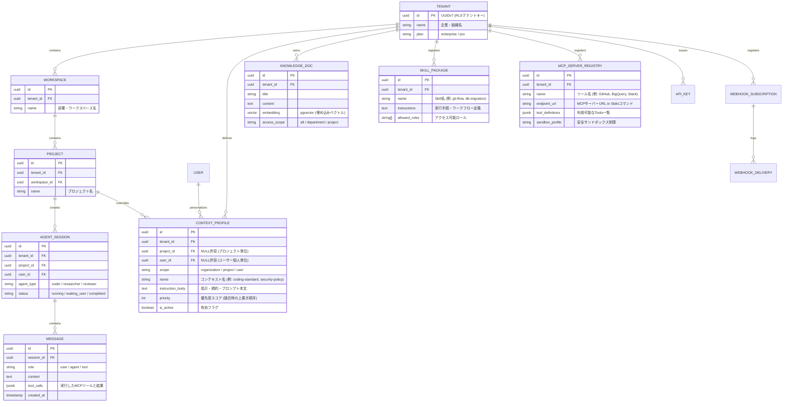

# AgentForge Enterprise サービス仕様書

本リポジトリでマイクロサービス化を検証・実装するための架空のB2B SaaS「**AgentForge Enterprise**」の業務ドメインおよび機能要件定義書です。

---

## 🏢 サービス概要

**AgentForge Enterprise** は、企業内で複数の自律型AIエージェント（リサーチャー、コーダー、カスタマーサポート、データアナリスト等）を編成し、安全なマルチテナント環境下でナレッジ（RAG/Skills）やツール（MCP）を共有・実行・統制するための**エンタープライズAIエージェント・オーケストレーションプラットフォーム**です。

### 👥 主要ターゲット & ユースケース

- **エンタープライズ企業**: 部署・プロジェクト単位で機密情報を厳格に分離しつつ、AIエージェントを活用したい企業。
- **権限・コンプライアンス管理**: 「経理エージェントには給与データへのアクセスを許可するが、開発エージェントにはアクセスさせない」等の厳格なRBAC。
- **個人 & プロジェクトのカスタマイズ**: 個人専用の `AGENTS.md` やプロジェクト固有のコンテキストルール、カスタムMCPツールの連携。

---

## 🗂 ドメインモデル & 階層型コンテキスト構造

---

## ⚙️ 主要な機能要件

### 1. 組織・権限 & IAM (Auth & IAM)

- **マルチテナント階層**: 企業（Tenant） ➔ 部署（Workspace） ➔ プロジェクト（Project） ➔ セッション（Session）。
- **粒度の細かいロール認可 (RBAC/ReBAC)**:
  - `Admin`: 企業全体のLLMモデル利用制限、全社コンテキスト、監査ログ閲覧。
  - `Project Manager`: プロジェクト固有のコンテキストルールや連携MCPサーバーの設定。
  - `Member`: 許可されたエージェントとの対話・実行。
- **外部連携用 API Key**: CI/CDや外部SaaSからエージェントを直接キックするための認証キー（`agf_live_...`）。

### 2. 🧠 階層型コンテキスト統合エンジン (Hierarchical Context Engine)

- **動的コンテキスト合成**:
  1. **企業レベル (Org Directive)**: 全社セキュリティ規約、禁止語句、コンプライアンス方針。
  2. **プロジェクトレベル (Project Context)**: リポジトリ規約、アーキテクチャ設計書、コーディングルール。
  3. **個人レベル (User Persona)**: 個人の対話スタイル、出力フォーマットの好み。
  4. **セッション短期記憶 (Working Memory)**: 直近の会話ログ、MCPツール実行履歴。
- **優先度制御 (Context Precedence)**:
  - 企業ポリシー ➔ プロジェクト規約 ➔ 個人指示 の順で優先度を調停し、トークン長上限（Context Window）に収まるよう自動要約・圧縮。

### 3. ナレッジ・Skills & MCPサンドボックス (Knowledge, Skills & Tools)

- **ベクトル検索 (RAG)**:
  - PostgreSQL RLS + `pgvector` により、他テナントの情報を物理遮断したセキュアなナレッジ検索。
- **Skill パッケージ配信**:
  - 業務ワークフローや手順書（Skill）をパッケージ管理し、権限のあるプロジェクトやエージェントに動的インジェクション。
- **MCP (Model Context Protocol) ツール実行**:
  - エージェントに許可された外部ツール（GitHub, Jira, DBクエリ, Slack等）を安全なサンドボックス経由で実行。
- **リアルタイム・ストリーミング**:
  - エージェントの思考過程、ツール実行結果、生成トークンを **Server-Sent Events (SSE)** でリアルタイム配信（GraphQL Subscription は不採用。[tech-selection §10](tech-selection.md#10-リアルタイム思考ストリーミング-bff--フロント) 参照）。

### 4. 📢 Webhook 通知 & イベント連携 (Event & Notification)

- **イベント自動配信**:
  - エージェントの「タスク完了（`agent.task_completed`）」「人間の確認待ち（`agent.approval_required`）」「エラー発生（`agent.failed`）」を外部URLへHMAC-SHA256署名付きで即座にWebhook配信。
- **リトライ・DLQ制御**:
  - 外部サーバー不通時の Exponential Backoff + Jitter リトライ、連続失敗時の Dead Letter Queue (DLQ) 隔離。

### 5. 🌐 外部連携 API (OpenAI 互換 & Management REST API)

- **OpenAI 互換エンドポイント (`POST /v1/chat/completions`)**:
  - 外部ツール（Cursor, Cline, LangChain, Python/TypeScript `openai` SDK）から `base_url="http://localhost:8080/v1"` と `api_key="agf_live_..."` を指定するだけで即座に対話・実行可能。
  - **自動インジェクション**: リクエストを受け取ると、API Keyからテナントを特定し、PostgreSQL RLSによる社内ナレッジ（RAG）や企業ポリシー（禁止事項）を裏側で自動的にプロンプト合成。
  - **SSE ストリーミング完全対応**: `stream: true` 時に OpenAI 互換の `data: {"choices": [{"delta": {"content": "..."}}]}` 形式で逐次配信。
  - **モデル一覧 (`GET /v1/models`)**: テナントで利用可能なエージェントプリセット（`agentforge-react`, `agentforge-researcher` 等）を返却。
- **管理・設定用 REST API**:
  - `POST /v1/contexts`: 企業規約・プロジェクトコンテキストの登録・更新。
  - `POST /v1/skills`: Skillパッケージ（業務ワークフロー手順書）の登録。
  - `POST /v1/webhooks`: Webhook通知先URLと購読イベントの管理。

---

## ⚡ サービス特性に起因する5大高負荷シナリオ

本サービス（AIエージェント基盤）特有のリアルな高負荷事象とアーキテクチャによる回避策です。

| シナリオ | 発生原因（ボトルネック） | 回避策（アーキテクチャ） |
| :--- | :--- | :--- |
| **① ストリーミング同時接続集中** | 朝礼や業務開始時に数百人のユーザーが同時にエージェントセッションを開き、長時間のHTTP接続（SSE）が持続。 | **Go Goroutine超並行 + HTTP/2多重化** BFF層で軽量コネクションを維持し、内部RPC接続を効率的にプーリング。 |
| **② ベクトル類似度検索の負荷集中** | 多数のエージェントが一斉に全社RAGに対して高頻度埋め込み検索を実行し、DB CPUが飽和。 | **2層キャッシュ (Embedding Cache) + PgBouncer** 同一クエリ・類似プロンプトの検索結果をRedisでキャッシュ。 |
| **③ MCPツールの同時大量バースト** | コーディングエージェントが複数ファイルを一括解析しようとして数十件のMCPツール呼出しを短時間に連打。 | **Singleflight + テナント別Token Bucketレートリミッター** 同一API/リソースへの重複呼出し集約と帯域制限。 |
| **④ 大量セッション履歴のページング** | 数万件に及ぶ過去の会話履歴・ツール実行ログの検索でDB全行走査が発生。 | **Keyset Pagination (UUIDv7)** `WHERE (created_at, id) < (cursor_time, cursor_id)` によるインデックスジャンプ。 |
| **⑤ 長時間実行タスクの非同期詰まり** | 複雑なリサーチタスク（数分〜数時間かかる処理）で同期APIがタイムアウト。 | **非同期ジョブキュー (NATS) + 状態ステートマシン** 即時 `202 Accepted` 返却し、進捗はWebhookやSSEで非同期通知。 |
